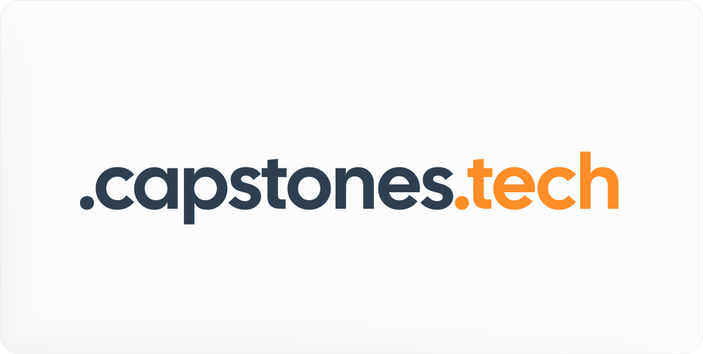

   

   
   
   
    

<h1 align="center">capstonedicoding.tech</h1>

<strong>capstonedicoding.tech</strong> is a service that allows developers to get a sweet-looking <code>.capstonedicoding.tech</code> subdomain for their personal websites.

---

# Register

- [Fork](https://github.com/dicoding-app/register/fork) the repository.
- Follow the instructions on our [documentation](https://docs.capstonedicoding.tech).
- Once you open your pull request (PR), it will be reviewed. *Keep an eye on it in case changes are needed!*
   - If changes have been requested, please make the specified changes otherwise **you will be rejected**.
- Once your PR is merged, your DNS records should be published with-in a few minutes.
- Enjoy your new `.capstonedicoding.tech` subdomain! Please consider leaving a star to help support us!

## Report Abuse
If you find any subdomains being abused or breaking our ToS, please report them by creating an issue with relevant evidence.

<!-- ---

We are supported by Cloudflare's sponsorship program.

 -->
